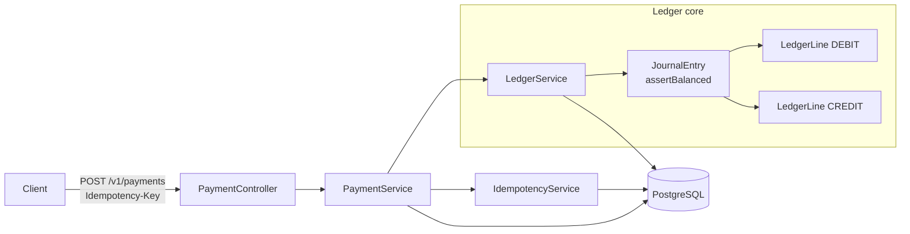

# LedgerFlow

A payment orchestration platform, built the way real payment systems are built: **correct under retries, exact with money, provably balanced, and consistent when things go wrong.**

Delivered so far:
- **Phase 1 — Financial core:** idempotent payment API + double-entry ledger
- **Phase 2 — Orchestration:** explicit state machine + saga with compensating transactions + Kafka event backbone
- **Phase 4 — AI risk:** real-time XGBoost fraud scoring with SHAP explanations (`fraud-service/`), wired into the saga's risk-check step
- **Phase 6 — LLM risk analyst:** Claude (via AWS Bedrock) turns SHAP reasons into a plain-English narrative for reviewers, plus a tool-calling ops assistant over payment/ledger data — both run outside the saga and fail soft to a deterministic local fallback

> The goal of this project is not to clone a checkout button. It is to demonstrate the machinery underneath a payment gateway — the parts that are hard to get right and that payment teams actually screen for: **idempotency, double-entry correctness, exact money arithmetic, safe state transitions, and real integration testing.**

---

## Why this design

Three decisions drive everything else, and each is a deliberate correctness choice:

1. **Money is never a floating-point number.** All amounts are integer *minor units* (paise/cents) stored as `BIGINT`/`long`. `0.1 + 0.2 != 0.3` has no place in a ledger.
2. **Balances are derived, never stored.** An account's balance is always computed by summing its ledger lines. A stored balance can drift out of sync with its transactions; a derived one is correct by construction. Every write posts a **balanced journal entry** (total debits = total credits), and that invariant is asserted in code *before* anything touches the database.
3. **Every write is idempotent.** Networks retry. A client that sends the same payment twice — same `Idempotency-Key` — gets the same result and is charged once. The unique key constraint in PostgreSQL, not application memory, is the source of truth, so it holds even under concurrent duplicate requests.

---

## Architecture



A payment capture posts one balanced journal entry:

| Account | Direction | Meaning |
|---|---|---|
| `ACQUIRER_CASH` (asset) | DEBIT | cash received from the acquirer |
| `MERCHANT_PAYABLE` (liability) | CREDIT | amount now owed to the merchant |

A refund posts the exact reverse. Because both sides always move together, the books are always balanced — the integration test asserts exactly this.

---

## Orchestration & the saga (Phase 2)

The orchestrated endpoint runs a payment through an explicit **saga**:

```
Authorize  ─▶  Risk check (ML)  ─▶  Capture (double-entry ledger)
   │                │                     │
   └── compensate ──┴──── compensate ─────┘   (reverse order on any failure)
```

- A **state machine** (`PaymentStateMachine`) is the single authority on legal
  transitions. Refunding a payment that was never captured isn't guarded against —
  it's *unrepresentable*.
- A generic **`SagaExecutor`** runs the steps and, on any failure, compensates every
  completed step in strict reverse order. If risk declines after authorization, the
  authorization hold is released and the payment ends `FAILED` — never half-done.
- Every step emits a **domain event** to Kafka (`payment-events`). A consumer
  persists them as an append-only **audit trail**, idempotent on event id because
  Kafka delivery is at-least-once.

Kafka is optional: set `ledgerflow.events.transport=noop` (the test profile does)
and events fall back to logging, so the app runs with just Postgres.

## Fraud scoring (Phase 4)

The risk-check step calls the Python **`fraud-service`** (XGBoost + SHAP) over HTTP.
Each decision returns a probability, an `APPROVE`/`REVIEW`/`DECLINE` verdict, and the
**top SHAP feature contributions** — so a decline always says *why*.

If the fraud service is slow or down, `HttpFraudScoringClient` degrades to a
**rules-based fallback** and flags the decision `degraded` rather than failing the
payment (fail-soft). Model details and metrics live in [`fraud-service/README.md`](fraud-service/README.md).

## LLM risk analyst & ops assistant (Phase 6)

Every risk decision the saga makes is persisted (`risk_decisions`). Two endpoints
build a natural-language layer on top of it, powered by **Claude on AWS Bedrock**
via **Spring AI** — and both are designed to run entirely *outside* the saga, so an
LLM outage can never affect a payment, only the richness of a narrative:

- `GET /v1/orchestrated-payments/{id}/risk-explanation` — find-or-generate a
  plain-English narrative over the payment's SHAP reasons, grounded strictly in
  those facts (the prompt forbids inventing new risk factors). Generated once and
  persisted (`risk_explanations`); later calls return the same narrative.
- `POST /v1/ops-assistant/ask` — a **tool-calling** ops assistant. Claude decides
  which read-only tool to call (`findRecentPayments`, `getPaymentDetail`,
  `getAccountBalance`) based on the question, then answers from the real result —
  no vector DB, no hallucinated data, and no tool can mutate anything.

Both features default to `ledgerflow.ai.provider=template` — a deterministic,
code-generated fallback with zero AWS dependency, so `mvn test`, local dev, and CI
never require AWS credentials. Set `AI_PROVIDER=bedrock` (plus AWS credentials and
Bedrock model access enabled for your account/region) to use the real model; any
failure — timeout, throttling, auth — falls back to the same template output,
flagged `degraded: true`.

---

## Tech stack

- **Java 21**, **Spring Boot 3.3** (Web, Data JPA, Validation, Actuator)
- **PostgreSQL 16** with **Flyway** migrations (schema is owned by migrations; Hibernate runs in `validate` mode)
- **Testcontainers** — integration tests run against a real Postgres, so migrations and SQL constraints are exercised for real
- **springdoc / Swagger UI** for live API docs
- **Docker Compose** for one-command local run
- Optimistic locking (`@Version`) on payments to guard concurrent state transitions

---

## Quickstart

```bash
# 1. Start Postgres + the app
docker compose up --build

# 2. Create a payment (idempotent)
curl -s -X POST http://localhost:8080/v1/payments \
  -H "Content-Type: application/json" \
  -H "Idempotency-Key: demo-001" \
  -d '{"merchantReference":"order-42","amountMinor":150000,"currency":"INR"}' | jq

# 3. Retry the SAME request — same key, same body → same payment, charged once
curl -s -X POST http://localhost:8080/v1/payments \
  -H "Content-Type: application/json" \
  -H "Idempotency-Key: demo-001" \
  -d '{"merchantReference":"order-42","amountMinor":150000,"currency":"INR"}' | jq

# 4. See the ledger is balanced (both return 150000)
curl -s http://localhost:8080/v1/accounts/ACQUIRER_CASH/balance | jq
curl -s http://localhost:8080/v1/accounts/MERCHANT_PAYABLE/balance | jq

# 5. Run the full orchestrated saga (authorize -> ML risk check -> capture)
curl -s -X POST http://localhost:8080/v1/orchestrated-payments \
  -H "Content-Type: application/json" \
  -d '{"merchantReference":"ord-9","amountMinor":250000,"currency":"INR",
       "risk":{"amountZscore":0.2,"txnVelocity1h":1,"geoDistanceKm":6,
               "deviceNew":0,"hourOfDay":13,"isForeign":0,"cardAgeDays":700}}' | jq

# A high-risk payload (unusual amount, high velocity, far geo, new device,
# foreign, brand-new card) is declined by the model with a 402, and the SHAP
# reasons appear in the app logs.

# 6. Inspect the event audit trail for a payment (populated via Kafka)
curl -s http://localhost:8080/v1/orchestrated-payments/<payment-id>/events | jq
```

- Swagger UI: `http://localhost:8080/swagger-ui.html`
- Health / metrics: `http://localhost:8080/actuator/health`
- Fraud API docs: `http://localhost:8000/docs`

Run tests (needs Docker for Testcontainers):

```bash
mvn test
```

---

## API

| Method | Path | Notes |
|---|---|---|
| `POST` | `/v1/payments` | Create + capture. **Requires `Idempotency-Key` header.** |
| `GET`  | `/v1/payments/{id}` | Fetch a payment |
| `POST` | `/v1/payments/{id}/refund` | Refund a captured payment (posts the reverse entry) |
| `GET`  | `/v1/accounts/{code}/balance` | Live, derived account balance |
| `POST` | `/v1/orchestrated-payments` | Full saga: authorize → ML risk check → capture |
| `GET`  | `/v1/orchestrated-payments/{id}/events` | Persisted event audit trail |
| `GET`  | `/v1/orchestrated-payments/{id}/risk-explanation` | Find-or-generate an LLM narrative over the risk decision |
| `POST` | `/v1/ops-assistant/ask` | Ask the tool-calling ops assistant a natural-language question |
| `POST` | `/score` *(fraud-service, port 8000)* | Fraud probability + decision + SHAP reasons |

Idempotency semantics:
- **Same key + same body** → replays the original response (no new payment).
- **Same key + different body** → `409 Conflict`.
- **Missing key** → `400 Bad Request`.

---

## What this proves I can do

- Model money and ledgers correctly (integer minor units, double-entry, derived balances)
- Design an idempotent, retry-safe write API the way Stripe/Razorpay do
- Enforce invariants in code *and* at the database (CHECK constraints, unique keys, FKs)
- Own a schema with versioned migrations
- Write integration tests against a real database, not mocks
- Model a payment lifecycle as an explicit state machine and a **saga** with compensating transactions, so multi-step flows stay consistent under failure
- Build an event-driven backbone on **Kafka** with an idempotent, at-least-once-safe consumer and a durable audit trail
- Train, tune, and serve an **XGBoost fraud model** with **SHAP explanations**, and integrate it into a JVM service with fail-soft degradation
- Integrate an LLM (Claude/Bedrock via Spring AI) as a **tool-calling agent** grounded in real data, with a config-selectable fail-soft fallback so an AI outage can never affect a payment
- Design cloud infrastructure as code (Terraform: VPC, ECS Fargate, RDS, MSK Serverless, scoped IAM) for a real AWS deployment

---

## AWS deployment

`infra/terraform/` provisions LedgerFlow on **ECS Fargate + RDS Postgres + MSK
Serverless**, with the app's task role scoped to call Bedrock for the risk analyst
above. It's authored as scaffolding to review and apply against your own AWS
account — nothing in this repo applies it for you. See
[`infra/terraform/README.md`](infra/terraform/README.md) for prerequisites (including
the manual step of enabling Bedrock model access in-console), the `plan`/`apply`
walkthrough, and how images get published to ECR (manually, or via
[`.github/workflows/build-and-push.yml`](../.github/workflows/build-and-push.yml)).

---

## Roadmap

- ✅ **Phase 1 — Financial core.** Idempotent payment API + double-entry ledger.
- ✅ **Phase 2 — Orchestrator.** Explicit state machine (`INITIATED → AUTHORIZED → CAPTURED → FAILED / REFUNDED`) with the **saga pattern** and compensating transactions, over a Kafka event bus with a persisted audit trail.
- ⬜ **Phase 3 — Webhooks + reconciliation.** Signed outbound events with retries and a dead-letter queue; a reconciliation engine matching the ledger against settlement files.
- ✅ **Phase 4 — AI fraud scoring.** XGBoost model with **SHAP explanations** in the decline response, so every "declined: fraud" says *why*. Fail-soft rules fallback.
- ⬜ **Phase 5 — Smart payment routing.** Predict success probability per acquiring route and route to maximise expected success at minimum cost (Razorpay-Optimizer style).
- ✅ **Phase 6 — LLM risk analyst & ops assistant (Spring AI + Bedrock).** Natural-language risk explanations grounded in SHAP reasons, and a tool-calling ops assistant over payment/ledger data. Fail-soft template fallback when Bedrock is unavailable.
- ⬜ **Phase 7 — Cloud deployment.** Terraform-provisioned AWS hosting (ECS Fargate, RDS, MSK Serverless) with CI-driven image publishing to ECR. IaC is authored (`infra/terraform/`); marking this done once it's actually applied to a live AWS account.

---


